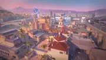
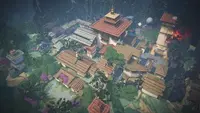
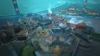
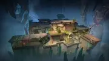
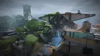
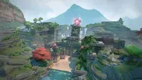

# **Valorant** 

## ¿Que es Valorant?
*Valorant* es un shooter táctico en primera persona de estilo hero shooter, desarrollado y publicado por Riot Games.
## ¿Cuando salio Valorant?
El desarrollo del juego comenzó en **2014**, y fue anunciado bajo el nombre en clave Project A en **octubre de 2019**. La beta cerrada, con acceso limitado, se lanzó el **7 de abril de 2020**, y el juego **fue lanzado oficialmente el 2 de junio de 2020**. Inicialmente, Valorant estaba diseñado exclusivamente para Windows, pero en junio de 2024 se añadió soporte para las consolas Xbox Series X/S y PlayStation 5
## ¿Como funciona?
En este juego, los jugadores toman el control de diferentes agentes. El modo principal de juego enfrenta a dos equipos de cinco jugadores cada uno, que asumen los roles de atacantes o defensores. Los agentes poseen habilidades únicas y emplean un sistema económico para adquirir habilidades y armas.
## Agentes
En el juego hay diferentes clases de agentes.
Estan el rol: 
- **Duelista:** Son asesinos autosuficientes que, gracias a sus habilidades y destrezas, suelen conseguir iniciar enfrentamientos y anotar muchos asesinatos. Como por ejemplo Raze que puede lanzar explosivos que hacen daño al enemigo.
  

- **Iniciador:** Son los que se centran en servirse de ángulos inusuales para ayudar a su equipo y adentrarse en territorios clave y alejar a los defensores. Como por ejemplo fade que lanza bestias que te marcan a los enemigos y los ciega.

- **Centinela:** Son expertos en defensa que se centran en bloquear áreas y vigilar los flancos tanto durante las rondas de ataque como en las de defensa. Como por ejemplo Cypher que pone unos cables que le avisa si el enemigo esta pasando por alli o puede poner una camara para ver si hay enemigos.

- **Controlador:** Son los que se especializan en dividir terrenos peligrosos en varias zonas para que su equipo pueda encargarse del resto. Como por ejemplo Clove que puede tirar un humo en el que los enemigos no ven haciendo que los compañeros puedan pasar con mas seguridad para posicionarse en una buena zona.

## Mapas
En el juego hay muchos diferentes mapas, pero hay algunos que les encanta a la comunidad y otros que la comunidad no les gusta mucho. 
### Unos de los mapas mas gustados son:

Sunset

Haven

Pearl

### Y unos de los odiados por la comunidad son:

Abyss

Fracture

Lotus
